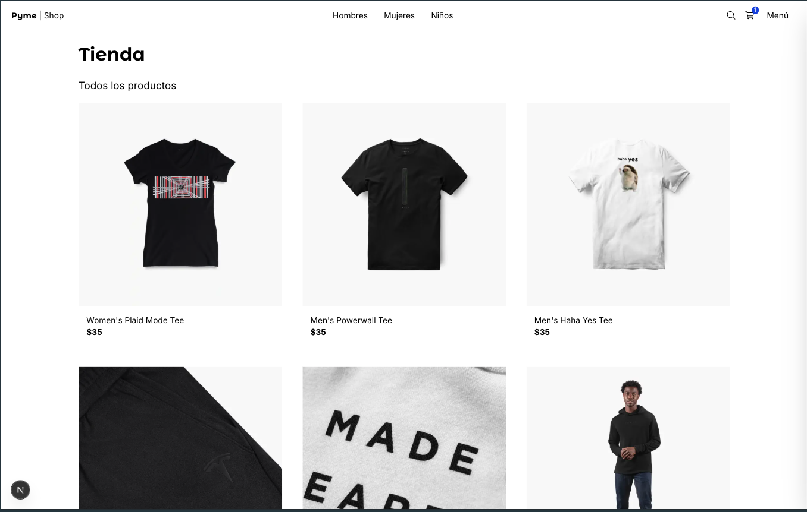

# 🛒 PymeShop

<!-- Standard Image Syntax -->


A modern online store system developed with Next.js (React) and Node.js, optimized for mobile devices and featuring an integrated payment gateway, allows users to create their own store to manage their products as they see fit.

## Getting Started

Follow the next steps to run the project on local environment.

First (optional) run docker container, for database

```bash
docker compose -f docker-compose.dev.yml up --build
```

Install dependencies

```bash
# recomended
pnpm install
```

Set environment variables

```bash
cp .env.template .env
```

Then run the development server:

```bash
npm run start:dev
# or
yarn start:dev
# or
pnpm start:dev
# or
bun start:dev
```

You can run migrations from prisma just like this:

```bash
docker exec -it postgres_pyme_shop_db_dev psql -U postgres -c "CREATE DATABASE \"pyme-shop\";"

pnpm dlx prisma migrate dev
```

For create a new migration use:

```bash
pnpm dlx prisma migrate dev --name [migration_name]

## [!IMPORTANT] for update models into generated migrations models
pnpm dlx prisma generate

# Create prisma models from database previous created
npx prisma pull
```

For create a Prisma Client:

https://www.prisma.io/docs/prisma-orm/quickstart/prisma-postgres

```bash
npx prisma generate
```

## Arquitecture

This project are develop with MVVM into Frontend and static side generation for rendering and backend.

```bash
├── README.md
├── AGENTS.md              # Map for agents (phased rollout)
├── prisma/
│   ├──schema.prisma       
│   ├──generated/       
│   ├──seed/       
│   ├──migrations/       
│       ├──2026..._initial/              
├── app/
│   ├──page.tsx       
│   ├──layout.tsx
│   ├──layout.tsx
├── src/   
│   ├── client/    # UI Layer
│   │   ├── stores/    # shared logic/stores
│   ├── core/    # Model Layer
│   │   ├── utils/    # Shared logic
│   │   ├── entities/    # Clases para encapsular data de la página
│   │   ├── types/    # Tipos para respuestas REST, parametros, datos genéricos, etc
│   ├── server/    # Dependency injectios
│   │   ├── actions/    # Async functions running into server
│   │   ├── providers/    # Dependency injections
│   │   ├── repositories/    # Encapsulate services with repository pattern
│   ├── shared/
│   │   ├── components/    # UI components shared throught all web
```

### SDD

It was configured a basic SDD harness for use IA as developer implementer.


```bash
├── AGENTS.md              # Map for agents (phased rollout)
├── CHECKPOINTS.md
├── .opencode/
│   ├── agents/            # leader, spec_author, implementer, reviewer
│   └── settings.json      # Hooks que automatizan la verificación
├── .agents/
│   └── skills/            # for speciality on a task
├── specs/
│   ├──feature_list.yml       # Full Feature list to implement and completed
│   ├──features/       # Spec features folder
│   │   └── <feature>/       # Spec por feature (Kiro-style)
│   │      ├── requirements.md    # EARS notation
│   │      ├── design.md          # Technical decisions
│   │      └── tasks.md           # Checklist for implementation
│   ├── progress/
│   │   ├── current.md         # Sesión activa (estado vivo)
│   │   └── history.md         # Bitácora append-only
├── docs/
│   ├── architecture.md    # Qué significa "buen trabajo"
│   ├── conventions.md     # Estilo, nombres, errores
│   ├── specs.md           # Proceso SDD: EARS, 3 archivos, aprobación humana
```


## License

This project are unde MIT license. Checkout the LICENSE file for more details.
